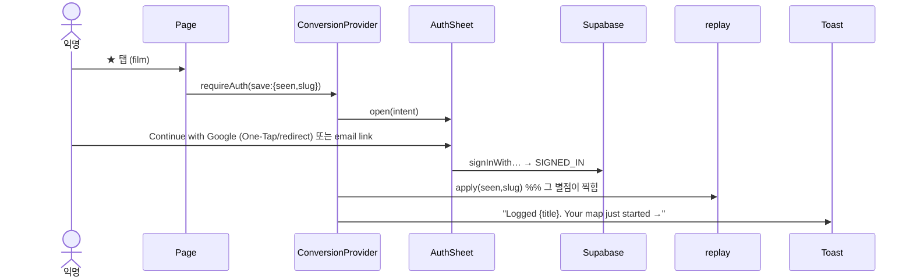

# HANDOFF — 회원가입·뉴스레터 획득 설계 (전환 메커니즘 구현 지침서)

> **`HANDOFF-동반자-전환-마스터.md`의 하위 구현층.** 마스터는 전략(IA·홈·메뉴·온보딩·앱·뉴스레터 리듬,
> P1~P5 이미 라이브)을 정한다. **이 문서는 그 전략을 실제로 작동시키는 "획득 기계"의 부품 도면이다** —
> AuthSheet·저스트인타임 게이트·의도 리플레이·소프트게이트 미리보기·표면별 배치·카피 뱅크·시퀀스·데이터
> 모델·빈도 거버넌스·퍼널 측정. 다른 에이전트가 이 문서만 읽고 그대로 구현할 수 있도록 구체적으로 쓴다.
>
> **상태:** 설계 v1 (2026-07-27). **오너 방향 확정(2026-07-27):** ①공격성 = **Balanced**(가치 순간에만 뜨는
> JIT + 소수의 능동적·해제가능 넛지; 첫 읽기 방해 0) ②최적화 1순위 = **계정 생성(영화 트래킹)**, 뉴스레터는
> 아직 준비 안 된 이를 위한 낮은 문턱 온램프. 잔여 세부 = §12 오너 결정.

---

## §0. 한 문장 & 불변식

> **소비를 투자로 전환한다.** 현관은 절대 막지 않는다(SEO·첫 읽기 개방 유지). 대신 방문자가 **간직할 만한
> 무언가를 하는 바로 그 순간**에, 문맥을 잃지 않는 시트로 "이걸 저장하려면 1탭"을 제안하고, 로그인되는 즉시
> **하려던 행동을 대신 완료한다.** 이 seamless함이 전부다.

**승계 불변식(마스터 + 코드베이스에서):**
1. **URL 불변** — 신규 라우트는 최소화. 게이트/시트/넛지는 기존 페이지 위에 얹는다. 리네임·noindex·리다이렉트
   변경 없음(사업전략 D2).
2. **서버 HTML 비개인화** — 계정 상태는 반드시 클라이언트 하이드레이션. 넛지의 노출 판단도 클라이언트에서
   (엣지 캐시·크롤러 오염 금지). `Nav.tsx` 패턴 그대로.
3. **활성화 정의(마스터 §5·§8):** 가입 → 임포트(또는 최소 시딩) → **7일 내 재방문.** 북극성 = **주간 재방문자.**
4. **뉴스레터 발신은 외향 행위** — 수집은 자유(옵트인), **발송 자동화는 오너 명시 승인 게이트**(마스터 §7.1).
5. **디자인 헌장:** Newspaper v3 — 흰 배경·near-black 잉크·단일 적색 `#E3120B`·정보밀도 높게·장식 낮게·
   **다크모드 없음.** 넛지는 조판을 무겁게 하지 않는다.
6. **품위 > 전환율** — 시네필 청중. 스팸 인상은 브랜드 자산을 태운다. §9 빈도 거버넌스가 상한이다.

**측정 가능한 목표(§10 상세):** 익명 방문자 → 가입 → 활성화(3★3.5+ / 서비스 저장 / 임포트) 퍼널을 `mt_events`
`props.name`으로 전 구간 계측. 스키마 변경 0.

---

## §1. 현행 실사 (코드 기준, 2026-07-27 — 조사 4에이전트 종합)

이 층이 얹힐 지형. 구현자는 이 사실을 전제로 삼는다.

### 1.1 인증 (정본 = `components/home2/Nav.tsx` 계정 UI)
- **가동 방식:** 이메일+비번(`signInWithPassword`), **Google OAuth 리다이렉트**(`signInWithOAuth({provider:"google"})`).
  콜백 = `app/auth/callback/route.ts`(`exchangeCodeForSession`, open-redirect 가드), 이메일확인/복구 = `app/auth/confirm/route.ts`(`verifyOtp`).
- **없는 것(신설 대상):** **매직링크/OTP 웹 로그인 없음**, **Google One-Tap/GIS 없음**, **Apple 없음**(단
  `app/privacy/page.tsx:75`는 Apple을 광고 → 카피/구현 불일치, 수정 대상). ⚠️ `verifyOtp` 인프라는 이미
  존재하므로 매직링크는 **소규모 추가**이지 재구축 아님.
- **로그인/가입 페이지:** `/login`("Welcome back", 이메일+비번+"Sign in with Google"), `/signup`("Create your
  cinema portfolio" + 혜택 3줄 + "One click — no email verification needed", 가입 후 → `/me/import`).
- **비대칭 함정:** 비번 가입은 이메일 검증 벽("Check your email")으로 사이트를 떠나야 함 / Google은 원클릭.
  가입은 `/me/import` 고정 착지, 로그인은 `?next` 존중 → **행동 도중 가입한 사용자가 그 행동으로 못 돌아옴.**
- **하드 게이트(→ `/login?next=`):** `/room/*` 전체(`app/room/layout.tsx:19`), `/me/import`, `/settings`, `/ask/new`,
  `/admin/*`·`/crm/*`. 즉 **비로그인은 룸의 빈 계기를 결코 못 봄** → 비로그인 가치 순간은 전부 **퍼블릭 페이지**에.

### 1.2 개인화 "아하" 표면 (조사2) — 전환 세일즈 포인트
- **⭐ My Films 렌즈(`components/LensProvider.tsx`) = 최대 레버:** 켜지면 **사이트 전체**의 모든 `/film/*` 링크가
  강조되거나(only 모드) 내 영화 중심으로 재정렬. **`ready && uid && seenCount>0`이면 즉시 발동**, 아니면 무음
  no-op(`:79`). → **"영화 한 편만 기록하면 사이트 전체가 내 것이 된다"**가 팔 북극성 아하.
- **/board(퍼블릭):** 비로그인 = seen 카운터가 로그인 링크(`BoardGrid.tsx:220`), Seen/Watchlist 토글 **disabled**
  + "Sign in to highlight…" 툴팁. "On my services" 토글은 비로그인도 동작(localStorage).
- **활성화 사다리(FormingCard 임계, 정본):** **3편 ★3.5+** → recs/pool/screener/map 점등(최조기·최고가치) ·
  **8편 seen** → NAV/Performance · **8편 loved ★4.5+** → Masquerade/Signature · **1편 seen** → coverage/directors/
  world-map. 모든 FormingCard에 이미 "…or import your Letterboxd history →"(`/me/import`) 보조 CTA.
- **최빈 미시순간:** 어떤 카드든 포스터의 ★/Seen/Watchlist 탭 → **현재 하드 리다이렉트**(`UserFilmsProvider.tsx:93`).

### 1.3 서비스(구독) — 제품 갭 = 전환 훅
- **`ServicesPicker`("My services")는 localStorage 전용, DB 미저장.** `user_services` 테이블 없음. 국가 기본
  Marquee=KR / board·journey=US(불일치). Navigator/room은 **saved 서비스를 읽지도 않음**(국가만, US 하드코딩).
  → 오너 예시("내 구독 저장하면 제대로 보인다")는 **전환 훅이자 미완 제품**. §8에서 함께 해결.

### 1.4 뉴스레터 (이미 라이브)
- **수집:** `components/SubscribeForm.tsx` → `sb.rpc("newsletter_subscribe",{p_email,p_source})`(단일 옵트인,
  잘못된 이메일 = `"invalid"` 반환). 성공 카피 = **"✓ You're in — the next edition lands in your inbox."**
  `p_source`로 **유입 출처 태깅 가능**(퍼널 귀속에 활용). 프롭: `source`, `button`, `dark`.
- **표면:** `/blog/subscribe`(데일리 "Between Film and the World"), `components/home2/NewsletterCard.tsx`("Get it
  each morning — free · No spam. Unsubscribe anytime"), Nav 드롭다운 풋터 "Newsletter" → `/blog/subscribe`.
- **테이블·발송(확인됨):** 구독자 = `newsletter_subscribers`(`status` 컬럼, `status=eq.active`). 발송기 =
  `worker/blog-send.py` → **Resend HTTP API**(`api.resend.com/emails/batch`, 100건 배치·DRY 기본, `--send`),
  발신 = `Metatake <wonwoo@metatake.net>`(metatake.net DKIM 검증됨). 콘텐츠 = `posts`(published) 데일리.
  ⚠️ **두 파이프라인 분리 필수:** 이 소비자 뉴스레터(Resend·warm·옵트인)와 **CRM 아웃리치(Gmail API·`crm_*`·
  cold)는 별개** — 평판 격리(cold는 별도 도메인 `get-metatake.*`). **뉴스레터 트래픽을 CRM 발신 신원과 절대
  혼합 금지.** ⚠️ **스키마가 repo에 없음**(대시보드 직접 적용) → 마이그로 캡처 대상(§8).
- **리듬 계약(마스터 §7.1):** 별도로 **매주 금요일 오후 KST "판단 다이제스트"**(Tonight 3 + 깊이 읽기 1 + 마이룸
  훅), 발송 초기 수동, 자동화 = 오너 승인 게이트, 유입 태그 `utm_source=digest`.
- ⚠️ **불일치(§12 D3):** 실가동 = **데일리**(`newsletter_subscribers` + `blog-send.py` + /blog/subscribe·NewsletterCard
  "each morning"), 마스터 §7.1 = **위클리 금요 다이제스트.** 동반자·계정우선 전략엔 **위클리**가 더 나은 훅.
  → 획득 카피는 다이제스트 기준으로 통일(캡처는 같은 `newsletter_subscribe` RPC·같은 테이블 공유; `p_source`로
  구분). **단일 옵트인 관찰됨(즉시 insert)·이중 옵트인 아님. 공개 원클릭 구독취소 토큰/링크 부재**(CRM용
  `app/api/crm/unsub/route.ts`는 별개) → §8-4에서 신설 대상.

### 1.5 계측 & 디자인 시스템 (조사4)
- **비콘:** `components/Metrics.tsx`(root) → `/api/metrics` → `mt_events`. 이벤트 `pageview|leave|click|vital`.
  명명 클릭 = `components/mtTrack.ts`의 `mtEvent(name)` 또는 `data-mt="name"`. **주의:** `mtEvent`는
  **(pathname,name)당 1회 디듀프** → 노출(impression)은 수동 발사, 변형/placement를 name에 인코딩. 신규
  스키마 불필요. 대시보드 `/admin/metrics`. **현재 signup/auth/cta 이벤트 0건**(전부 신설).
- **루트 프로바이더(`app/layout.tsx:161`):** `UserFilmsProvider > UserSavesProvider > LensProvider` + `Footer`
  `GlobalCmdK` `Metrics` `LocaleSuggestBanner`. → **ConversionProvider를 여기 얹기 쉬움.**
- **재사용 프리미티브:** 토큰 `--accent:#E3120B`·`--ink:#0D0D0D`·`--hairline:#D8D8D8`, 서체 PT Serif(display)+
  Inter(UI), 사각 모서리·hairline 보더. `.btn`/`.btn-ghost`/`.card`/`.field`/`.standfirst`/`.seclbl`/`.chip`.
  **모달 패턴 = `ShareDock.tsx`의 `BottomSheet`**(`role=dialog aria-modal`, `.shd-ov` z1200 / `.shd-sheet`,
  다크 조상 방어로 시트 내부 라이트 강제). **배너 패턴 = `LocaleSuggestBanner`**(1회 노출 + localStorage
  dismiss 키). **토스트 = `components/room/Toast.tsx`**(현재 룸 전용 — 루트로 승격 필요). **전역 토스트·전역
  가입 모달은 현재 없음** → 신설.
- **콘텐츠-하단 삽입점(정확 위치):** `ReadPlates.tsx` `.rd-cta`(모든 필름 서브페이지) · `DirectorPlates.tsx`
  (감독 서브페이지) · 필름 Tier-1 메인 `#df-watch`↔`SeqNav` 사이(`_shared.tsx:~2042`) · `HubExplore.tsx`(전 허브) ·
  홈 `MyCinemaTeaser`/`ExploreLinks` 하단 · board/odyssey/journey/lineage 말미 `.ody-hero`/`.lh-flag` 밴드.

---

## §2. 전환 아키텍처 — 3층 모델

```
        ┌──────────────────────────────────────────────────────────────┐
LAYER A │  익명 소비 (SEO·첫 읽기) — 절대 안 막음. 넛지 0 on first read. │
        └───────────────┬──────────────────────────────────────────────┘
                        │  가치 순간(저장 시도·소프트게이트·깊은 스크롤·재방문)
        ┌───────────────▼──────────────────────────────────────────────┐
LAYER B │  전환 (AuthSheet: Google/One-Tap/매직링크) + 의도 리플레이     │
        │  또는 낮은문턱 온램프(뉴스레터=이메일 1개 → 그 이메일이 계정)  │
        └───────────────┬──────────────────────────────────────────────┘
                        │  활성화 사다리 (표면이 해금되는 지점마다 요청)
        ┌───────────────▼──────────────────────────────────────────────┐
LAYER C │ 활성화: ①1편 seen(렌즈 점등) →②3편 ★3.5+(recs) →③서비스 저장 │
        │        →④임포트(지도 채움) →⑤8 seen(NAV) →⑥8 loved(서명)     │
        └──────────────────────────────────────────────────────────────┘
```

**두 원칙이 전부:**
- **가치 순간 = 트리거, 페이지뷰 ≠ 트리거.** "저장할 만한 걸 한 바로 그때" 저장을 청한다.
- **소프트게이트, 빈 벽 금지.** 개인화 표면은 **채워진 모습의 미리보기 + 인라인 CTA 1개**를 렌더 —
  방금 QA에서 고친 무음 no-op을 절대 재현하지 않는다.

---

## §3. 인증 기반 (P0 — 이후 전부의 토대)

### 3.1 `AuthSheet` — 유일한 인증 표면
사이트 전역 단일 컴포넌트. 문맥만 프롭으로 바꿔 모든 트리거가 재사용.

**파일:** `components/auth/AuthSheet.tsx` (+ `auth.css` 또는 인라인 토큰 스타일, ShareDock BottomSheet 패턴 복제).

**Props**
```ts
type AuthIntent =
  | { kind: "save"; verb: "seen"|"watchlist"|"rate"|"follow"|"save"; label: string; replay: () => void }
  | { kind: "claim"; surface: "board"|"lens"|"room"|"pool"|"coverage"|"services" }
  | { kind: "newsletter" }        // 이메일만 → 매직링크 계정 겸용
  | { kind: "generic" };
interface AuthSheetProps {
  open: boolean; onClose: () => void;
  intent: AuthIntent;             // 헤드라인/서브카피/성공 후 행동을 결정
  next?: string;                  // OAuth 왕복 시 돌아올 경로(기본 현재 pathname+search)
}
```

**레이아웃(ASCII):**
```
┌──────────────────────────────────────────┐
│                                     ✕     │
│  {contextual headline}                    │   ← intent별 (§6 카피 뱅크)
│  {one-line subcopy}                       │
│                                           │
│  [  ⟳  Continue with Google           ]   │  ← 1순위, 적색 아웃라인/검정 텍스트
│  ─────────────  or  ─────────────         │
│  [ you@example.com          ] [ →/Send ]  │  ← 이메일 → 매직링크 (signInWithOtp)
│                                           │
│  No password, ever. One tap and you're in.│
│  By continuing you agree to Terms·Privacy.│
└──────────────────────────────────────────┘
```

**동작:**
- **버튼 1 "Continue with Google":** `signInWithOAuth({provider:"google", options:{ redirectTo:
  ${origin}/auth/callback?next=${enc(next)}&intent=${enc(serialize(intent))} }})`. (intent를 next에 실어 왕복 후
  리플레이 — §3.3.)
- **이메일:** `signInWithOtp({ email, options:{ emailRedirectTo: ${origin}/auth/confirm?next=…&intent=… } })` →
  성공 시 시트가 "Check your inbox — we sent a one-tap sign-in link to {email}."로 전환(비번 벽 제거).
  ⚠️ **신규:** 매직링크 로그인은 현재 미가동 → Supabase Auth에서 이메일 OTP/매직링크 활성 + `/auth/confirm`이
  `verifyOtp`로 이미 처리하므로 링크 클릭 착지만 `?next` 존중하도록 확인.
- **비번 필드 없음.** 기존 `/login`·`/signup`의 비번은 존치(레거시)하되 **AuthSheet엔 노출 안 함.**
- **성공 콜백(`onAuthStateChange` SIGNED_IN):** 시트 닫고 → `intent.replay()`(있으면) 실행 → 성공 토스트.

### 3.2 Google One-Tap (GIS) — Balanced의 능동 넛지 1
- **파일:** `components/auth/GoogleOneTap.tsx`(root, ConversionProvider가 조건부 마운트). `accounts.google.com/gsi/client`
  로드 후 `google.accounts.id.initialize({ client_id, callback })` → `signInWithIdToken({provider:"google", token})`.
- **발동 규율(§9):** 비로그인 + 가치 순간 도달(예: 2번째 세션, 또는 board/film 페이지에서 dwell>20s) + One-Tap
  쿨다운(dismiss 후 7일). **첫 방문 랜딩 즉시 금지**(방해). `cancel_on_tap_outside:true`.
- CSP: `gsi/client` 스크립트·`accounts.google.com` 프레임 화이트리스트 필요(next.config/미들웨어 헤더).

### 3.3 의도 리플레이(Intent Replay) — seamless의 심장
익명 저장 클릭 → AuthSheet → 로그인 즉시 **그 영화가 저장됨.**
- **동일 페이지 경로(모달, 리다이렉트 없음):** intent.replay 클로저가 원 액션을 다시 호출. (이메일 매직링크는
  같은 탭 복귀 후 `sessionStorage["mt_pending_intent"]`에서 복원 → 리플레이.)
- **OAuth 왕복 경로:** intent를 `?intent=`(직렬화, 저장류만 — slug+verb; 함수는 복원 불가하므로 **선언형
  intent**로 인코딩)로 실어 콜백 후 `ConversionProvider`가 파싱 → 해당 mutation 재실행 → toast.
- **선언형 intent 표준:** `{v:"seen"|"watch"|"rate"|"follow"|"save", slug, rating?}` — 모든 저장 게이트가 이
  형태로 발행. 리플레이 실행기 = `lib/conversion/replay.ts`(useUserFilms/useUserSaves/EntityActions 매핑).

### 3.4 `ConversionProvider` (root)
**파일:** `components/conversion/ConversionProvider.tsx` — `app/layout.tsx`의 LensProvider **안쪽**에 마운트
(개인화 컨텍스트 접근). 제공: `useAuthGate()`(아래), 전역 `<AuthSheet>` 1개, 전역 `<Toast>`(룸 토스트 승격),
One-Tap 오케스트레이션, **빈도 거버넌스 상태**(§9: 세션당 모달 1회·dismiss 기억), 콜백 intent 리플레이.
```ts
const { requireAuth } = useAuthGate();
// requireAuth(intent): 로그인이면 intent.replay() 즉시; 아니면 AuthSheet(intent) 오픈. bool 반환(이미 인증?).
```
**불변식:** 노출/발동 판단은 전부 클라이언트(마운트 후). 서버 HTML 불변.

---

## §4. 전환 컴포넌트 라이브러리

각 항목: 목적 · 배치 · 동작 · 카피는 §6 참조 · 파일.

| 컴포넌트 | 목적 | 핵심 동작 | 신규/재사용 |
|---|---|---|---|
| **AuthSheet** (§3.1) | 유일 인증 표면 | Google/One-Tap/매직링크 + 리플레이 | 신규 |
| **useAuthGate / SaveGate** | 저스트인타임 | 익명 저장류 클릭 가로채 AuthSheet(save intent) | 신규(기존 리다이렉트 대체) |
| **LockedPreview** | 소프트게이트 | 채워진 미리보기(샘플/블러) + 인라인 CTA | 신규 |
| **JoinCard** | 콘텐츠-하단 | 카드형 가입 권유(문맥 카피) | 신규 |
| **NewsletterInline** | 낮은문턱 온램프 | `SubscribeForm` 래핑 + 문맥 source | 재사용+확장 |
| **ServiceSyncPrompt** | 서비스→계정 | localStorage 서비스 저장 감지 → "계정에 기억" | 신규(+제품 배선) |
| **ActivationChecklist** | 로그인-후 활성화 | 3단계 진행 넛지(임포트·서비스·평점3) | 신규 |
| **OneTap** (§3.2) | 능동 넛지 | 조건부 One-Tap | 신규 |

### 4.1 `SaveGate` / `useAuthGate` — JIT 전환 (최고 레버)
**현재 하드 리다이렉트를 모달로 교체.** 다음 핸들러의 `router.push('/login?next=…')`를 `requireAuth({...})` 호출로 바꾼다:
- `components/UserFilmsProvider.tsx:93`(apply → seen/watch/rate 공통 · **최빈**)
- `components/EntityActions.tsx:53`(follow/like) · `components/SaveButton.tsx:43` · `components/UserSavesProvider.tsx:53`
- `components/MovieListActions.tsx:41`(need 가드) · `components/marquee/MarqueeExplorer.tsx`(hide-seen/save) 등
```ts
// UserFilmsProvider.apply(x) — before: if(!uid) router.push('/login?next='+path)
if (!uid) { requireAuth({ kind:"save", verb, label: filmTitle, replay:()=>apply(x), decl:{v:verb, slug, rating} }); return; }
```
**결과:** 익명 사용자가 필름 페이지에서 ★를 탭 → 페이지 그대로, 시트가 "Keep {title} — one tap"으로 올라옴 →
Google 1탭 → 시트 닫히며 **그 별점이 찍힘** + toast "Logged {title}. Your map just started →". (리다이렉트 폴백:
JS 실패/구형 시 기존 `/login?next=` 유지 — 점진 향상.)

### 4.2 `LockedPreview` — 소프트게이트 (빈 벽 금지 원칙의 구현)
개인화 표면의 비로그인/film-less 상태를 **채워진 미리보기**로. 두 변형:
- **Sampled:** 실제 데이터의 일부/데모(예: board를 "당신이 봤다면" 임의 12편 점등한 고스트) + 오버레이 CTA.
- **Blur-tease:** 채워진 레이아웃을 블러 + "Sign in to reveal" 캡션.
```
┌───────────── 실제 계기(흐리게/샘플) ─────────────┐
│  ▓▓▓ ▓▓▓ ▓▓▓ ▓▓▓ ▓▓▓ ▓▓▓ ▓▓▓ ▓▓▓ ▓▓▓ ▓▓▓ ▓▓▓  │
│            ┌───────────────────────────┐          │
│            │  {locked headline}        │          │
│            │  {one line}               │          │
│            │  [  Claim this →  ]       │          │  → requireAuth({kind:"claim",surface})
│            └───────────────────────────┘          │
└───────────────────────────────────────────────────┘
```
**적용:** /board seen-카운터·토글(비로그인) · My Films 렌즈 토글(비로그인 클릭) · 데스크 pool/map/coverage/
directors(로그인·film-less — 이미 honest-empty 카피 있음, 여기에 인라인 CTA만 추가).

### 4.3 `JoinCard` — 콘텐츠-하단 (Balanced 능동 넛지 2)
고트래픽 SEO 페이지 말미. **읽기를 방해하지 않는 카드 1개.** 문맥 카피(§6).
**삽입점(§1.5):** `ReadPlates.tsx` `.rd-cta` 옆 · `DirectorPlates.tsx` · 필름 메인 `_shared.tsx:~2042` · `HubExplore` ·
board/journey/odyssey/lineage 말미 밴드. **규율:** 비로그인일 때만 렌더(클라 판단) · 세션 1회 dismiss 기억 ·
크롤러엔 안 뜸(SSR 미개인화 유지, 클라 마운트 후 삽입).

### 4.4 `NewsletterInline` — 낮은문턱 온램프
`SubscribeForm`(기존)을 문맥 프레임으로 래핑, `source`로 배치 태깅(예: `"film-foot"`, `"board-foot"`, `"exit"`).
**계정 겸용 훅:** 다이제스트는 계정 없이도 구독 가능. 성공 후 마이크로카피 "Want the full map too? Finish your
account →"로 계정으로 승격(같은 이메일 → 매직링크). ⚠️ 구독취소 링크·이중옵트인 확인(§9).

### 4.5 `ServiceSyncPrompt` — 서비스→계정 (오너 예시의 정면 해결)
`ServicesPicker`에서 서비스 저장(localStorage `mt-watch-prefs`) 발생 시 감지:
- **비로그인:** 토스트/미니시트 "Saved on this device. Keep it on every device — one tap." → AuthSheet(claim:services).
- **로그인 & 미저장:** 서비스 의존 표면(/what-to-watch·board·journey·navigator no-tolls) 첫 도달 시 "Tell us what
  you subscribe to and we'll only ever suggest what you can play tonight." → ServicesPicker 오픈.
- **제품 배선(§8 필수):** 저장된 서비스를 계정에 영속(`user_services`) + **navigator/room이 이를 읽도록**(현재
  US 하드코딩 제거). 이게 없으면 "저장해도 제대로 안 보임" 오너 불만이 남는다.

### 4.6 `ActivationChecklist` — 로그인-후 활성화 (Layer C)
로그인했으나 미활성 사용자에게 /room 상단 + 데스크에 **해제가능·진행형** 3~4단계.
```
┌─ Get set up ─────────────────────────  ✕ ─┐
│  ◉ Account created                         │
│  ○ Import your history      [ Import → ]   │  → /me/import (또는 Trakt/TMDB/Simkl 개통 시)
│  ○ Save your services       [ Add → ]      │  → ServicesPicker
│  ○ Rate 3 films ★3.5+   (1/3)  [ Rate → ]  │  → QuickRate; 3 도달 시 recs 해금 축포
└────────────────────────────────────────────┘
```
서버 상태 = `onboarding_state`(§8) + 실데이터(user_movies count, services saved) 조인. 전부 완료 시 자동 소멸.
FormingCard의 기존 임계(3★3.5+·8seen·8loved)와 **동일 언어**로 연결.

---

## §5. 표면별 배치 지도 (핵심 — "페이지 구석구석")

각 행 = 표면 · 트리거 · 프롬프트 · intent · 빈도 · 이벤트. 카피는 §6.

| # | 표면(파일) | 트리거 | 프롬프트 | intent | 빈도 규율 | mt 이벤트 |
|---|---|---|---|---|---|---|
| 1 | **모든 포스터/필름 액션**(`PosterActions`·`MovieListActions`·`UserFilmsProvider`) | 익명이 ★/Seen/Watchlist 탭 | **AuthSheet**(save) + 리플레이 | save:{verb,slug} | 무제한(사용자 개시) | `gate_save:{verb}` shown/success |
| 2 | **감독·엔티티 액션**(`EntityActions`·`SaveButton`) | 익명이 Follow/Save 탭 | AuthSheet(save/follow) | save:follow | 사용자 개시 | `gate_follow` |
| 3 | **필름 메인**(`_shared.tsx:~2042`) | 스크롤 ≥70% & 비로그인 | **JoinCard**("이 영화를 기록으로") | claim:room | 세션1회·dismiss7일 | `joincard:film` shown/click |
| 4 | **필름 서브페이지**(`ReadPlates.rd-cta`) | 페이지 하단 도달 & 비로그인 | JoinCard(문맥="이 감독/영화 계속") | claim:room | 세션1회 | `joincard:readplates` |
| 5 | **감독 페이지**(`DirectorPlates`/`_shared:1335`) | 하단 & 비로그인 | JoinCard(감독 팔로우 훅) | save:follow | 세션1회 | `joincard:director` |
| 6 | **/board**(`BoardGrid`) | 비로그인 도달 | **LockedPreview**(seen 카운터·토글 = 소프트게이트) | claim:board | 상시(인라인, 모달 아님) | `locked:board` view/click |
| 7 | **/board 토글 클릭**(disabled Seen/Watchlist) | 비로그인이 토글 시도 | AuthSheet(claim:board) | claim:board | 사용자 개시 | `gate_board_toggle` |
| 8 | **My Films 렌즈**(`LensToggle`·`MyFilmsRibbon`·`/my-films`) | 비로그인이 렌즈 토글 | AuthSheet(claim:lens) + **"한 편이면 사이트가 바뀐다"** | claim:lens | 사용자 개시 | `gate_lens` |
| 9 | **/journey**(`MetatakeDeck`) | 비로그인 seen-pile "Nothing logged yet" | 인라인 CTA(hide-seen 켜려면) | claim:pool | 상시 인라인 | `locked:journey` |
| 10 | **/what-to-watch·board·journey**(서비스 의존) | 서비스 미저장으로 표면 도달 | **ServiceSyncPrompt** | claim:services | 표면당 세션1회 | `svc_prompt:{surface}` |
| 11 | **ServicesPicker 저장**(익명) | 서비스 저장 이벤트 | 토스트→AuthSheet(계정에 기억) | claim:services | 저장당 1회 | `svc_save_anon` |
| 12 | **홈**(`MyCinemaTeaser`·`MyFilmsRibbon`·`ExploreLinks` 하단) | 비로그인 도달 | 기존 밴드 강화 + JoinCard(ExploreLinks 하단) | claim:room | 상시 인라인 | `home_join` |
| 13 | **전 허브**(`HubExplore`) | 하단 & 비로그인 | JoinCard(간결) | claim:room | 세션1회 | `joincard:hub` |
| 14 | **Google One-Tap**(전역) | 비로그인 & 2세션+ or dwell>20s | One-Tap 프롬프트 | generic | dismiss후 7일 | `onetap` shown/accept |
| 15 | **뉴스레터**(footer 상시 + /blog·/updates 말미 + JoinCard 대체안) | 상시(footer) / 콘텐츠 말미 | **NewsletterInline** | newsletter | footer 상시·모달넛지 세션1회 | `nl:{source}` |
| 16 | **로그인-후 미활성**(/room 상단·데스크) | 로그인 & 미활성 | **ActivationChecklist** | — | 완료까지 상시·해제가능 | `activation_step:{n}` |
| 17 | **In-room FormingCard**(각 계기) | 로그인 & 임계 미달 | 기존 FormingCard + 임포트/서비스 CTA 강화 | — | 상시 인라인 | `forming:{feature}` |
| 18 | **/login·/signup**(재설계) | 도달 | 매직링크+One-Tap 추가·post-auth = intent/next 통일 | — | — | `authpage_method` |
| 19 | **exit-intent**(선택, Growth 시만) | 데스크톱 exit-intent & 비로그인 & 고가치 페이지 | NewsletterInline(1회/방문) | newsletter | 방문1회·평생 dismiss | `exit_nl` |

**Balanced 기본 채택:** 1·2·7·8·11(사용자 개시) + 3·4·5·13·15(콘텐츠 말미, 세션1회) + 6·9·17(상시 인라인
소프트게이트) + 10·16(활성화) + 14(One-Tap). **19(exit-intent)는 Growth-forward 선택 시만**(§12 D 재확인).

---

## §6. 카피 뱅크 (전 문맥 · 브랜드 보이스 = 차분·문학적·2인칭·구체)

> **보이스 규칙:** 세일즈 금지, 구체 명사, "무엇이 당신 것이 되는가"를 말한다. `tr(locale,…)` 경유,
> **신규 문자열은 ko 사전 동시 추가**(마스터 §3.2). 아래는 EN 원본.

**AuthSheet 헤드라인/서브(intent별):**
| intent | 헤드라인 | 서브카피 |
|---|---|---|
| save:seen | "Keep *{title}* on your shelf" | "One tap and it's logged — your map starts filling in." |
| save:watchlist | "Save *{title}* for later" | "Your watchlist follows you everywhere on Metatake." |
| save:rate | "Remember what you thought of *{title}*" | "Rate it once; it tunes every recommendation after." |
| save:follow | "Follow {name}" | "New readings on {name} come to you." |
| claim:board | "See your canon light up" | "Sign in and this board marks every film you've seen." |
| claim:lens | "Turn the whole site into *your* cinema" | "Log one film and every page re-centers on what you've watched." |
| claim:pool | "Build a pool that's actually yours" | "Films scored for your taste, minus what you've already seen." |
| claim:services | "Only see what you can play tonight" | "Tell us your subscriptions once — we remember them on every device." |
| claim:room | "Open your cinema portfolio" | "Coverage, blind spots, taste — your watching life as one map." |
| newsletter | "The Metatake Read" | "One film, read closely — in your inbox, every Friday. Free." |

- **공통 하단:** "No password, ever. One tap and you're in." · 법적 "By continuing you agree to our [Terms] and [Privacy]."
- **버튼:** "Continue with Google" · 이메일 send "Email me a link" · 이메일 성공 "Check your inbox — a one-tap
  sign-in link is on its way to {email}."

**JoinCard(문맥별 헤드라인 + 단일 CTA):**
- 필름: "You're reading *{title}* closely. Keep a record of the films you've seen — it takes one tap." → **"Start your shelf →"**
- 감독: "Following {name}? New readings can come to you." → **"Follow {name} →"**
- 허브/일반: "Metatake is better when it knows your films." → **"Make it yours →"**

**LockedPreview 오버레이:**
- board: "You've seen more of these than you think." / "Sign in and we'll count them." → **"Claim this board →"**
- lens(ribbon 강화): "New — flip the whole site to the films you've seen." → **"Try it with your films →"**

**ServiceSyncPrompt:**
- 익명 저장 후: "Saved on this device. Keep your services on every device — one tap." → **"Remember these →"**
- 서비스 의존 표면 도달: "We can narrow this to what you can actually watch tonight." → **"Pick your services →"**

**ActivationChecklist:** 제목 "Get set up" · 단계 "Import your history" / "Save your services" / "Rate 3 films you
love (★3.5+) to unlock recommendations" · 3편 도달 축포 토스트 "Recommendations unlocked — your Tonight pick is
ready →".

**성공 토스트(리플레이 후):** "Logged *{title}*. Your map just started →" / "Saved to your watchlist." /
"Following {name}." — 각 토스트에 room으로 가는 accent 링크 1개.

**뉴스레터(다이제스트 기준 통일):** 제목 "The Metatake Read" · 데크 "One film read closely, plus what's worth
your Friday night. Free — unsubscribe anytime." · 성공 = 기존 "✓ You're in — the next edition lands in your inbox."
(⚠️ /blog/subscribe "daily" 카피와 통일 여부 = §12 D3.)

---

## §7. 시퀀스 (상태 기계)

**7.1 익명 → 회원 (JIT 저장, 동일 페이지):**

**7.2 뉴스레터 → 계정 워밍:** 이메일 캡처 → `newsletter_subscribe` → 성공 카피 → (미로그인) "Finish your account
→" → 같은 이메일 매직링크 → 계정 → ActivationChecklist. (구독자는 utm=digest 재방문 시 로그인 유도.)
**7.3 로그인-후 활성화:** 로그인 → onboarding_state 조회 → 미완 단계 ActivationChecklist → 각 단계 완료마다
갱신 → 3★3.5+ 도달 시 recs 해금 축포 → 전부 완료 시 소멸. (활성화 = 마스터 §5 정의와 일치.)
**7.4 서비스 → 계정 영속:** ServicesPicker 저장 → (익명) AuthSheet(services) → 로그인 → `user_services` upsert →
navigator/room이 이를 읽어 재렌더("제대로 보임").

---

## §8. 데이터 모델 & 마이그레이션 (최소)

> 마이그레이션은 `curation-handover/` 규약 · `worker/apply-sql.py` 적용(오너 `!` 실행). RLS 필수.

1. **`user_services`(신규)** — 오너 예시의 제품 갭 해소. `(user_id uuid, country text, providers text[], updated_at)`
   PK=user_id. RLS: 본인만. + SECURITY DEFINER `me_set_services(p_country,p_providers)` / `me_services()`.
   **배선:** localStorage `mt-watch-prefs` ↔ 계정 양방향 동기(로그인 시 계정 우선). navigator `load.ts`·room이
   국가 하드코딩(US) 대신 `me_services()` 사용.
2. **`profiles` 확장(또는 `user_prefs`)** — `marketing_consent bool`, `email_optin_at timestamptz`,
   `onboarding_state jsonb`(예 `{imported:false, services:false, rated3:false, dismissed:{}}`).
3. **넛지 dismiss 기억** — 1차 = localStorage 키(`mt_nudge_<id>` + `mt_nudge_until`), 2차 = 로그인 사용자
   `onboarding_state.dismissed`에 미러(교차기기). 서버 미러는 로그인 시에만.
4. **뉴스레터 스키마·구독취소·동의(신설 — 확인 완료):**
   - **스키마 in-repo화:** `newsletter_subscribers` DDL + `newsletter_subscribe(p_email,p_source)`가 repo에 없음
     (대시보드 전용) → 마이그로 캡처(현행 재현 + 아래 컬럼 추가). 컬럼: `email`(PK)·`status`·`source`·`created_at`.
   - **원클릭 구독취소(법적 필수, 현재 reply-기반뿐):** **CRM의 검증된 HMAC 패턴을 이식** — `app/api/crm/unsub/route.ts`
     의 `unsubToken(email)`/무인증 토큰 라우트를 뉴스레터 스코프로 복제 → `app/api/newsletter/unsub/route.ts`
     (토큰 → `status='unsubscribed'`) + **`worker/blog-send.py`·다이제스트 발송 하단 + `List-Unsubscribe` 헤더에
     `{base}/api/newsletter/unsub?t={token}` 삽입.** (기존 reply-"unsubscribe"는 수동·불충분.)
   - **마케팅 동의 플래그:** `profiles`에 컬럼 없음 + `app/settings/page.tsx:169-174` "Notifications" = 비작동 스텁.
     → `profiles.marketing_consent`/`email_optin_at` 추가하고 **그 스텁을 실작동 토글로 배선**(계정↔구독 연결:
     로그인 사용자가 다이제스트 옵트인 시 그 이메일로 `newsletter_subscribers` upsert). 계정 이메일 자동구독 금지(명시 동의만).
   - `p_source` 값 = §5 이벤트 name과 일치 표준화. ⚠️ **이중 옵트인 없음**(즉시 active) → 도입 여부 = §12 D6.
5. **퍼널 = 스키마 변경 0** — `mt_events.props.name` 명명 규약(§10)만. "activated"는 서버측(user_movies count≥3
   ★3.5+ / user_services 존재)로 판정, 비콘 아님.

---

## §9. 빈도·품위 거버넌스 (스팸 방지 = "세련되게"의 상한)

**철칙:**
- **세션당 능동 모달/One-Tap 최대 1회.** 사용자 개시(저장 클릭 등)는 이 상한과 무관.
- **첫 방문 랜딩·첫 읽기 방해 0.** JoinCard/One-Tap은 관여 신호(스크롤≥70%·dwell>20s·2세션+) 후에만.
- **dismiss 기억:** 넛지별 dismiss → localStorage(+로그인 시 서버 미러). JoinCard dismiss = 7일 침묵. exit-intent
  dismiss = 평생. One-Tap dismiss = 7일.
- **크롤러·SEO 불변:** 넛지는 클라 마운트 후 삽입(SSR HTML 미변경) → 색인·성능·서버 개인화 불변식 준수.
  콘텐츠 위에 스크롤 게이트로 텍스트를 가리지 않는다(첫 읽기는 항상 완주 가능).
- **a11y:** AuthSheet = `role=dialog aria-modal` + 포커스 트랩/복원 + Esc(ShareDock BottomSheet 패턴). 넛지 카드
  = `:focus-visible`. `prefers-reduced-motion` 존중. 배너/토스트 `role=status`.
- **정직:** 위조 사회증거·가짜 카운트다운 금지(브랜드 신뢰 = 지표 정직성). "unsubscribe anytime"은 실제
  구독취소가 작동할 때만 표기(§8-4).
- **로그인 사용자에겐 가입 넛지 전면 억제**(활성화 넛지만).

---

## §10. 측정 (퍼널 — 스키마 변경 0)

**이벤트 명명 규약(`mtEvent(name)`; name에 placement·variant 인코딩, 디듀프 회피):**
- 노출: `nudge_shown:{id}` (수동 발사 — impression). 클릭: `nudge_click:{id}`. 닫기: `nudge_dismiss:{id}`.
- 게이트: `gate_shown:{intent}` / `gate_success:{intent}` (AuthSheet 오픈·인증완료).
- 방법: `auth_method:{google|onetap|magiclink}`.
- 뉴스레터: `nl_submit:{source}`.
- **활성화(서버측 파생, 비콘 아님):** 가입 후 user_movies·user_services·rated3 상태를 `/admin/metrics` 확장
  패널에서 집계(마스터 §8 북극성 = 주간 재방문자와 연동).
**퍼널 뷰:** prompt_shown → prompt_click → gate_shown → gate_success → activated(서버). `session`/`visitor`로 조인.
`/admin/metrics`에 "Conversion funnel" 패널 추가(`mt_generate_insights` 크론 위에). 뉴스레터 유입 = `utm_source=digest`.

---

## §11. 페이즈 (승인 시 페이즈별 세부지침 별도)

| 페이즈 | 내용 | 규모 | 선행 | 수용 기준 |
|---|---|---|---|---|
| **P0** | 이 설계 확정 — §12 D 결정 | 대화 | — | 오너 D 승인 |
| **P1 · 기반** | AuthSheet + 매직링크 + One-Tap + 의도 리플레이 + ConversionProvider(root) + 전역 토스트 승격 | 중 | P0 | 익명 ★탭→시트→로그인→그 별점 찍힘(3방법 전부); tsc 래칫 유지 |
| **P2 · JIT 게이트** | §5-1·2·7·8·11 저장 리다이렉트 → requireAuth 교체(+리다이렉트 폴백) | 중 | P1 | 6개 핸들러 모달화; 리플레이 검증; 이벤트 발사 |
| **P3 · 소프트게이트+콘텐츠엣지** | LockedPreview(board/lens/journey/desk) + JoinCard(필름/서브/감독/허브/홈) | 중 | P1 | 무음 no-op 0; 세션1회·dismiss 기억; SSR 미개인화 확인 |
| **P4 · 서비스→계정** | `user_services` 마이그 + 양방향 동기 + navigator/room 배선 + ServiceSyncPrompt | 중 | P1 | 서비스 저장이 room에 반영("제대로 보임"); US 하드코딩 제거 |
| **P5 · 뉴스레터 획득** | NewsletterInline 배치(footer/말미) + source 태깅 + 이중옵트인·구독취소 확인/신설 | 소 | P1 | 캡처 3+ 지점; 구독취소 작동; utm=digest |
| **P6 · 활성화+측정** | ActivationChecklist + onboarding_state + 퍼널 패널(/admin/metrics) | 소 | P2~P5 | 3단계 진행/소멸; 퍼널 5단계 집계 |

배포 규율: app/components/lib=워처→staging, 루트/마이그=수동, 마이그 = 오너 `!`. tsc 래칫(웹20/모바일0) 유지.

---

## §12. 오너 결정 (P0 게이트)

- [ ] **D1. One-Tap 채택:** Google One-Tap(GIS) 도입 여부(전환 최대 레버지만 3rd-party 스크립트·CSP 추가).
- [ ] **D2. 매직링크 to /login·/signup:** 기존 비번 페이지에도 매직링크/One-Tap 추가 & 비번 강등(숨김) 여부.
- [ ] **D3. 뉴스레터 정체성 통일:** 데일리("Between Film and the World") vs 위클리 다이제스트(마스터 §7.1) —
      획득 카피를 **위클리 "The Metatake Read"로 통일** 권장(계정우선 훅). 승인/대안.
- [ ] **D4. exit-intent(§5-19):** Balanced=제외 / Growth-forward=포함. 채택 여부.
- [ ] **D5. 비로그인 룸 미리보기(마스터 D4 승계):** /room 샘플 데모 모드로 소프트게이트할지(전환 큰 이득·비용).
- [ ] **D6. 구독취소·이중옵트인:** 현행 `newsletter_subscribe`에 구독취소/이중옵트인이 없다면 P5에서 신설
      승인(법적 권장).

---

## §14. 실행 로그 (AS-BUILT) — 2026-07-28 밤샘 구현 P1~P6 (오너 "D1~D6 완벽 구현" 승인)

**전부 프로덕션 라이브** (커밋 a216864·f696863·8f4e226 → main+staging). tsc 래칫 20 유지. 라이브검수:
홈·AuthSheet(문맥카피)·/what-to-watch 무회귀 확인. **불변식 준수**(서버HTML 비개인화·URL불변·다크모드없음).

**P1 기반 (a216864):** `components/conversion/` — **AuthSheet**(Google OAuth + **매직링크 signInWithOtp** + 문맥
카피, 비번없음, a11y 포커스트랩/Esc, 모바일 바텀시트) · **ConversionProvider**(root, LensProvider 안쪽) ·
**GoogleOneTap**(⚠️`NEXT_PUBLIC_GOOGLE_CLIENT_ID` 미설정 시 완전 no-op) · 전역 토스트 · **의도 리플레이**
(reload 기반: `mt_intent` URL/sessionStorage → execDecl) · 빈도 거버넌스. 이벤트버스(`lib/conversion/bus.ts`)로
부모 프로바이더도 시트 호출. **D1(One-Tap)·D2(매직링크)=채택·env게이트.**

**P2 JIT 게이트 (a216864):** 익명 저장 6표면(UserFilmsProvider·UserSavesProvider·SaveButton·MovieListActions·
EntityActions)이 `/login` 풀리다이렉트 → **인문맥 AuthSheet + 로그인 후 그 행동 리플레이**. (follow/MovieListActions는
slug 없어 리플레이 없이 재탭.)

**P3 소프트게이트+콘텐츠엣지 (f696863):** JoinCard(자가은닉·세션1회·dismiss기억·크롤러투명) = 필름 메인/카탈로그·
ReadPlates·감독메인·DirectorPlates·HubExplore. board 카운터·journey seen-pile = 인문맥 시트. LockedPreview 프리미티브.

**P4 서비스→계정 (f696863):** MarqueeExplorer가 서비스를 **계정에 영속**(fault-soft) + 교차기기 동기 + 마퀴 익명
버튼이 "Sign in to keep your services"로 적응. ⚠️**미완(후속): navigator/room 서버가 me_services를 읽어 US
하드코딩 제거** — 마이그 적용 후 별도 작업(서버 로더 변경·현재는 국가 하드코딩 유지).

**P5 뉴스레터 (8f4e226):** Footer 캡처("The Metatake Read") · Settings 주간다이제스트 실토글(profiles.marketing_consent
+ 뉴스레터 구독, fault-soft) · **원클릭 구독취소 `/api/newsletter/unsub`**(무상태 HMAC·마이그 불필요·즉시작동) ·
`worker/blog-send.py`가 수신자별 토큰+링크+List-Unsubscribe 헤더 주입(JS와 바이트동일 검증). **D3 통일=획득 카피
"The Metatake Read"** · **D6 구독취소=신설완료**(이중옵트인 미도입=현행 유지). **D4 exit-intent=미포함(Balanced).**

**P6 활성화+퍼널 (8f4e226):** ActivationChecklist(/room, import→서비스→3★3.5+ · 라이브데이터 파생 · 완료시 자가은닉 ·
해제가능) · 퍼널 이벤트(gate_*/nudge_*/activation_*) 전 프롬프트 발사(스키마변경0). ⚠️/admin/metrics 퍼널 패널=후속.

### 🔑 오너 아침 할 일 (5분)
1. **마이그 2개 적용**(`!`): `python3 worker/apply-sql.py supabase/migrations/0114_user_services.sql` +
   `…/0115_newsletter_consent.sql`. → 서비스 계정영속 + 마케팅동의 컬럼 활성(현재 fault-soft로 무해히 대기 중).
2. **(선택) Google One-Tap 켜기:** Vercel env `NEXT_PUBLIC_GOOGLE_CLIENT_ID`=GIS 클라이언트ID → One-Tap 발동
   (미설정=현행 no-op, Google OAuth 버튼은 이미 작동).
3. **(선택) `NEWSLETTER_UNSUB_SECRET`** env(Vercel+워커 동일값) — 미설정 시 REVALIDATION_SECRET 폴백으로 동작.
4. **로그아웃 상태 E2E**(오너만 가능): 익명으로 필름 ★탭→시트→Google/매직링크→그 별점 찍히는지 1회 확인.
5. **`app/privacy/page.tsx:75`** Apple 언급 = 미구현이므로 문구 정리(별건).

### D 결정 반영 요약
D1 One-Tap ✅채택(env게이트) · D2 매직링크 ✅추가(AuthSheet; 기존 /login 비번 존치) · D3 ✅"The Metatake Read"
위클리 통일(캡처 공유) · D4 exit-intent ✅미포함(Balanced) · D5 비로그인 룸 미리보기 = LockedPreview 프리미티브
준비·룸은 여전히 로그인게이트(전체 데모모드는 후속) · D6 ✅원클릭 구독취소 신설(이중옵트인 보류).

## §13. 개정 로그
- **2026-07-27 v1** — 최초 설계. 조사 4에이전트(인증·아하표면·뉴스레터·CTA/계측/디자인) + 마스터 정합.
  오너 방향 확정(Balanced·계정우선). 3층 모델·AuthSheet·의도 리플레이·소프트게이트·표면 19배치·카피 뱅크·
  시퀀스·데이터 모델·거버넌스·퍼널·페이즈 P0~P6.
- **2026-07-28 v2 — P1~P6 전부 구현·라이브** (§14 실행 로그). 잔여: 마이그2개 적용(오너 `!`)·navigator 서버
  서비스배선·admin 퍼널패널·로그아웃 E2E.
